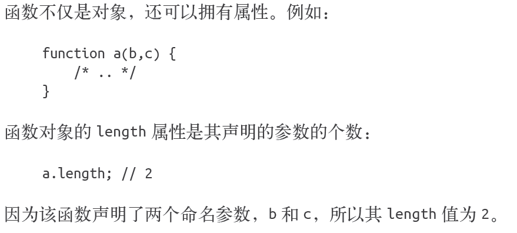

## 类型
#### 内置类型

Javascript有七种内置类型：
- 空值（null）
- 未定义（undefined）
- 布尔值（boolean）
- 数字（number）
- 字符串（string）
- 对象（object）
- 符号（symbol，ES6中新增）
注：前五个是**基本数据类型**
我们可以用**typeof** 运算符来查看值的类型，它返回的是类型的字符串值。有意思的是，这七种类型和它们的字符串值并不一一对应：
- typeof undefined === "undefined";
- typeof true === "boolean";
- typeof 42 === "number";
- typeof "42" === "string";
- typeof { life: 42 } === "object";
**null比较特殊：**
- typeof null === "object";（null是基本类型中唯一一个假值类型）
该有一种情况：
- typeof function a(){ /* .. */ } === "function";
functio（函数）也是JavaScript的一个内置类型，它实际上是object的一个“子类型”

- typeof [1,2,3] === "object";数组也是对象。确切地说，它也是object的一个“子类型”，数组的元素按数字顺序来进行索引（而非普通像对象那样通过字符串键值），其length 属性是元素的个数。
####值和类型
JavaScript中的变量是没有类型的，**只有值才有**。变量可以随时持有**任何类型**的值。
- 42的类型为number，并且无法更改。而"42" 的类型为string。数字42可以通过*强制类型转换*（coercion）为字符串"42"。

在对变量执行typeof 操作时，得到的结果并不是该变量的类型，而是该变量持有的值的类型，因为JavaScript 中的变量没有类型。
- var a = 42;
typeof a; // "number"
a = true;
typeof a; // "boolean"
*（typeof 运算符总是会返回一个字符串：）*
##### undefined 和undeclared
变量在未持有值的时候为undefined。此时typeof 返回"undefined"：
- var a;
typeof a; // "undefined"

很多开发人员将undefined 和undeclared 混为一谈， 但在JavaScript 中它们是两码事。undefined是**值的一种**。undeclared则表示**变量还没有被声明过**。
遗憾的是，JavaScript 却将它们混为一谈，在我们试图访问"undeclared" 变量时这样报错：ReferenceError: a is not defined， 并且typeof 对undefined 和undeclared 变量都返回"undefined"。（所以老师课上没提到过undecleard）

## 值
#### 数组
和其他强类型语言不同，在JavaScript 中，数组可以容纳任何类型的值，可以是字符串、数字、对象（object），甚至是其他数组（多维数组就是通过这种方式来实现的：
- var a = [ 1, "2", [3] ];
a.length; // 3
a[0] === 1; // true
a[2][0] === 3; // true

对数组声明后即可向其中加入值，不需要预先设定大小
- var a = [ ];
a.length; // 0
a[0] = 1;
a[1] = "2";
a[2] = [ 3 ];
a.length; // 3

数组通过数字进行索引，但有趣的是它们也是对象，所以也可以包含字符串键值和属性（但这些并不计算在数组长度内）：
- var a = [ ];
a[0] = 1;
a["foobar"] = 2;
a.length; // 1
a["foobar"]; // 2
a.foobar; // 2

这里有个问题需要特别注意，如果字符串键值能够**被强制类型转换为十进制数字**的话，它就会被当作数字索引来处理。
- var a = [ ];
a["13"] = 42;
a.length; // 14

#### 字符串
字符串经常被当成字符数组。字符串的内部实现究竟有没有使用数组并不好说，但
JavaScript中的字符串和字符数组并不是一回事，最多只是看上去相似而已。
例如下面两个值：
- var a = "foo";
var b = ["f","o","o"];

字符串和数组的确很相似，它们都是类数组，都有length 属性以及indexOf(..)和concat(..) 方法：
- a.length; // 3
b.length; // 3
a.indexOf( "o" ); // 1
b.indexOf( "o" ); // 1
var c = a.concat( "bar" ); // "foobar"
var d = b.concat( ["b","a","r"] ); // ["f","o","o","b","a","r"]
a === c; // false
b === d; // false
a; // "foo"
b; // ["f","o","o"]

但这并不意味着它们都是“字符数组”，比如：
- a[1] = "O";
b[1] = "O";
a; // "foo"
b; // ["f","O","o"]
*JavaScript 中字符串是不可变的，而数组是可变的*

另一个不同点在于字符串反转（**JavaScript 面试常见问题**）。数组有一个字符串没有的可变更成员函数reverse()：
- a; // "foo"
b; // ["f","O","o","!"]
a.reverse; // undefined
b.reverse(); // ["!","o","O","f"]
b; // ["f","O","o","!"]

#### 数字
JavaScript 中的数字常量一般用十进制表示。
由于数字值可以使用Number 对象进行封装，因此数字值可以调用Number.prototype中的方法，例如，tofixed(..) 方法可指定小数部分的显示位数：
- var a = 42.59;
a.toFixed( 0 ); // "43"
a.toFixed( 1 ); // "42.6"
a.toFixed( 2 ); // "42.59"
a.toFixed( 3 ); // "42.590"
a.toFixed( 4 ); // "42.5900"

#### 特殊数值
undefined 类型只有一个值，即undefined。null 类型也只有一个值，即null。它们的名称既是类型也是值。undefined和null常被用来表示“空的”值或“不是值”的值。二者之间有一些细微的差别。例如：
- null 指空值（empty value）
undefined 指没有值（missing value）

或者：
- undefined 指从未赋值
null 指曾赋过值，但是目前没有值

null 是一个特殊关键字，不是标识符，我们不能将其当作变量来使用和赋值。然而undefined 却是一个标识符，可以被当作变量来使用和赋值。

NaN 是一个特殊值，它和自身不相等，是唯一一个非自反（自反，reflexive，即x === x 不成立）的值。而NaN != NaN 为true

## 强制类型转换

